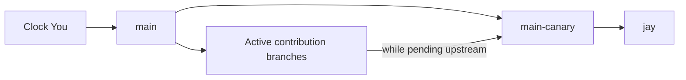

# Contributing to Jay

Jay builds directly on Clock You's source, and a lot of what makes it useful comes from the work already done there, mainly the base clock features. I keep this structure mainly because I want to contribute back to the projects I build on whenever I can. Jay benefits directly from Clock You, and I do not want generally useful improvements to become trapped in the fork just because I happened to need them here first.

Keeping `main` as Clock You, `main-canary` as Clock You plus contributions still waiting upstream, and `jay` as the social extension makes that relationship explicit. It preserves the original upstream history, gives suitable changes a clear route back, and keeps my additions distinguishable from the work Jay was built on.

## Where things belong

Jay uses Clock You's alarm services, Room database, activities, and Android manifest components directly. This is possible because the extension happens in the source code. A runtime plugin would not be able to safely share all of that by injecting features into another APK.

The social code lives together so that someone reading the project can understand what Jay adds:

- `server/` contains the complete Jay server and PostgreSQL protocol.
- `app/src/main/java/com/bnyro/clock/social/` contains social storage, networking, synchronization, workers, and group UI.
- `device_alias_words.json` contains the generated device-name vocabulary.
- `SocialDatabase` keeps group and remote-revision state separate from Clock You's database.
- `SharedAlarmLink` connects remote alarms to unchanged Clock You `Alarm` rows.

Some Jay's social features have to be built on top of the clock core implementation itself. Changes to Clock You-owned files for those features commonly stay within these integration points, but not limited to:

- application startup and dependency construction.
- the home navigation list.
- the alarm list's group labels, editing permissions, and source filter.
- the alarm editor's group selector.
- alarm create, edit, and delete dispatch.
- shared-alarm time-zone resolution during scheduling.
- ringing, snooze, and early-dismiss actions.
- the timer's start dispatch, including the group a group timer is started for.
- timer add-time, reset, and stop dispatch, and the ringing timer's answer actions.
- the timer list's group labels and action permissions.
- the saved-timer sheet's group template field.
- settings, launcher branding, dependencies, resources, and manifest declarations.

The existing clock behaviour is the foundation for these connections. For example, a shared alarm uses Clock You's alarm scheduling too. Maintaining a second scheduler just for groups would mean fixing the same problems in two places, and the two could eventually behave differently.

For changes that are useful to Clock You on its own, the starting point is a focused contribution branch from `main`, with the work submitted upstream. This includes alarms, clocks, timers, the stopwatch, settings, onboarding, notifications, and pickers. Social groups, shared alarms, membership, synchronisation, social notifications, entitlements, and the server are developed directly on `jay`.

The [architecture guide](docs/architecture.md) describes the social protocol, persistence and worker boundaries. [Server deployment](server/README.md#deployment) and [performance guidance](server/README.md#performance) cover operations and release acceptance.

## Building shared audio

The Android build uses NDK 29.0.14206865 and CMake 3.31.6, pinned in `app/build.gradle.kts`. Install these through Android SDK Manager before building, or allow Android Gradle Plugin to install them after accepting the SDK licenses. CMake fetches the official libFLAC 1.5.0 source archive and verifies its pinned SHA-256. Initial native configuration requires network access; subsequent builds reuse the source in the build cache.

`app/src/main/cpp/social/flac_encoder.c` implements the shared-audio encoder using libFLAC. It builds for armeabi-v7a, arm64-v8a, x86 and x86_64, retaining API 23 support. The library is statically linked into `libjay_audio.so`; command-line programs, C++ bindings, Ogg support and background encoding threads are disabled. The Xiph BSD license is included in the APK at `assets/licenses/libFLAC.txt`. Keep its version, source hash and license synchronized when updating the library.

## How the branches fit together

There are three long-lived branches, with merges flowing in one direction: `main` -> `main-canary` -> `jay`. Contribution branches join that flow while their work is waiting upstream.

| Branch | What it is for |
| --- | --- |
| `main` | The clean Clock You base, with its exact upstream history, original commit messages, and commit hashes. |
| Contribution branches | Focused Clock You improvements intended for upstream. Each starts from `main` and receives base updates from there. |
| `main-canary` | Clock You together with every active contribution still waiting upstream. It contains no social code and publishes nothing. |
| `jay` | The social extension on top of `main-canary`, with the integration points described above. All prereleases and stable releases come from here. |

An `upstream` remote points to Clock You. Preserving its history in `main` means we can compare and update the base without creating another copy of the same commits. `main` always feeds into `main-canary`, even when there are no pending contributions, and every active contribution branch is merged into `main-canary` while it waits upstream.

Fixes follow the same arrangement. A Clock You defect is fixed on its contribution branch, then brought into `main-canary` and `jay`. A social defect is fixed directly on `jay`. This keeps the fix with the work it belongs to, so an upstream contribution includes its own corrections.

Pushing to `jay` also publishes a build. Ordinary pushes create prereleases, while a head commit message beginning exactly with `Release ` creates a stable release. The [release guide](docs/releases.md) explains the details, so it is worth checking the head message before a push.

## Bringing in upstream changes

An upstream update involves the contribution branches as well as the three long-lived branches. Keeping them current means the work we send back to Clock You is based on what Clock You actually has now.

### Before starting any implementation...

A good starting point is fetching `origin` with pruning and fetching `upstream`, then reviewing the upstream changes alongside the local branches, their remote counterparts, and any linked worktrees. Uncommitted work needs to be preserved throughout the update. Looking at all of this first helps avoid overlooking a contribution just because it is checked out somewhere else.

The upstream main branch is merged into `main` without squashing, preserving the original history. If `origin/main` already has the update, it can be used after checking that it matches `upstream/main`.

### Keeping contributions current

The next part is identifying which contributions are still pending. When Clock You accepts a contribution, its accepted implementation becomes the one we use, including any changes made during upstream review. Once that implementation is in `main`, the old contribution branch no longer needs updates or further merges into `main-canary`.

Every contribution that is still active receives the updated `main`, including those checked out in linked worktrees. Conflicts are resolved on the contribution branch so its pending changes work alongside the accepted upstream implementation. Base updates come from `main`; bringing in `main-canary` or `jay` would also bring unrelated contributions or social code into the upstream work.

From there, the updated `main` is merged into `main-canary`, followed by every active contribution branch. Finally, `main-canary` is merged into `jay`, where conflict resolution stays within the documented integration points.

### Tidying up finished branches

Local contribution branches can be removed when their tracked branches have been deleted from `origin` and their work is preserved in `main` or `main-canary`, or superseded by an accepted upstream implementation. Linked worktrees and uncommitted changes need a check before removal too.

A missing remote branch on its own does not tell us whether the work is safe to remove. If there is work that has not been preserved, the branch stays, and that outstanding work should be noted in the update. This cleanup and the contribution branch updates are part of keeping the repository current, even if the accepted changes have already reached `main-canary` and `jay`.

### Checking the result and sharing it

Verification covers both the changed contribution branches and the integrated `jay` result. For an upstream update, that means running the server tests against PostgreSQL and the Android unit tests, and compiling the Android debug and release variants.

Device checks cover creation, update, deletion, snooze, early dismissal, reboot rescheduling, invitation links, and server switching. If a check could not be completed, please include that in the update so the next person knows what still needs attention.

Once the update is ready and committing and pushing have been agreed, any remaining conflict resolutions are committed and all updated branches are pushed to `origin/main`, every active contribution branch, `main-canary`, and `jay`. Checking the `jay` head message against the [release rules](docs/releases.md) beforehand makes sure the push publishes the intended kind of build. A final comparison between the local branches and their remote counterparts confirms that the complete update was shared.

For example, if Clock You accepts a timer improvement with some changes, those changes come into `main` first. Any other pending contributions are updated from that base, then everything flows through `main-canary` into `jay`. The old timer contribution stops being merged, and its local branch can be cleaned up once its tracked remote branch is gone and its work is accounted for. Jay gets the accepted implementation, and the remaining contributions stay ready for upstream review.
